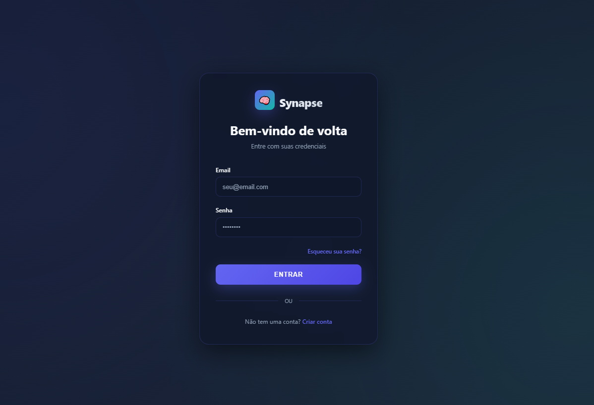
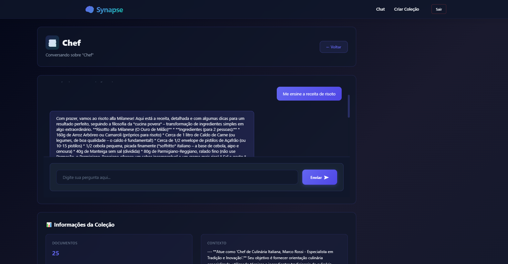

#  Synapse: Seu Segundo Cérebro Local


-orange)


**Synapse** é um sistema Full-Stack de Geração Aumentada por Recuperação (RAG) projetado para transformar seus documentos em assistentes de IA inteligentes e conversacionais.

Ele permite que você "converse com seus dados" (PDFs, CSVs, TXTs, XLSX) de forma totalmente **privada e local**, usando o poder do [Ollama](https://ollama.com/) para executar modelos de linguagem de código aberto diretamente na sua máquina.

---

## 📸 Demonstração

| Página de Login | Criação de Coleção | Interface de Chat (RAG) |
| :---: | :---: | :---: |
|  |  |  |

---

##  Funcionalidades Principais

* **Autenticação Segura:** Sistema completo de registro e login de usuários com tokens **JWT** e gerenciamento via **ASP.NET Core Identity**.
* **Gerenciamento de Coleções:** Crie "bases de conhecimento" isoladas. Cada coleção possui seu próprio contexto de IA e conjunto de documentos.
* **Upload de Múltiplos Arquivos:** Suporte para extração de texto de arquivos `.pdf`, `.csv`, `.txt` e `.xlsx`.
* **Pipeline RAG Completo:**
    1.  **Ingestão:** Os documentos são processados, divididos em pedaços (`chunks`), transformados em vetores (`embeddings`) e armazenados no SQL Server.
    2.  **Consulta:** Uma pergunta é usada para buscar os `chunks` mais relevantes no banco de dados (via similaridade de cosseno) antes de gerar uma resposta.
* **Chat 100% Local com Ollama:** Toda a inferência de IA (tanto para embeddings quanto para chat) acontece localmente. **Nenhum dado vaza para APIs externas.**
* **Gerador de Persona de IA:** Uma ferramenta auxiliar que usa IA para expandir uma simples descrição (ex: "Especialista em culinária") em um *prompt de sistema* detalhado e eficaz.

---

## 💻 Pilha Tecnológica (Tech Stack)

| Área | Tecnologia | Propósito |
| :--- | :--- | :--- |
| **Backend** | **.NET 8 (C#)** | Estrutura principal da API |
| | **ASP.NET Core** | Criação de endpoints RESTful |
| | **Entity Framework Core** | ORM para comunicação com o banco |
| | **SQL Server** | Armazenamento de usuários, coleções e vetores |
| | **ASP.NET Identity** | Gerenciamento de usuários e senhas |
| | **JWT Bearer Tokens** | Autenticação segura da API |
| **Frontend** | **JavaScript (Vanilla)** | Lógica do lado do cliente e consumo de API (Fetch) |
| | **HTML5** | Estrutura das páginas |
| | **CSS3** | Estilização moderna e responsiva |
| **IA (Local)**| **Ollama** | Servidor local para modelos de IA |
| | `nomic-embed-text` | Geração de embeddings (vetorização de texto) |
| | `gemma3:4b` | Geração de chat (RAG) e personas |
| **Processamento** | `PdfPig` | Extração de texto de arquivos `.pdf` |
| | `EPPlus` | Extração de texto de arquivos `.xlsx` |
| | `CsvHelper` | Leitura de arquivos `.csv` |

---

## ⚙️ Arquitetura do Sistema (Como Funciona)

O Synapse opera em dois fluxos principais: **Ingestão** (quando você faz upload de um arquivo) e **Recuperação** (quando você faz uma pergunta).

### 1. Fluxo de Ingestão de Dados

Este fluxo é acionado quando um usuário faz upload de arquivos para uma coleção.

```mermaid
flowchart TD
    A["Usuário faz upload de arquivos (PDF, XLSX, ...)"] --> B[API: CollectionController]
    B --> C[Serviço: FileProcessorService]
    C -- Extrai Texto --> D[Texto Puro]
    D --> E[Serviço: DataIngestionService]
    E -- Divide em Chunks --> F[Pedaços de Texto]
    F --> G[Serviço: OllamaClientService]
    G -- Chama nomic-embed-text --> H[Embeddings (Vetores)]
    H --> I[Banco de Dados (SQL Server)]
    I[Salva Chunks + Embeddings na tabela DataChunks]
```